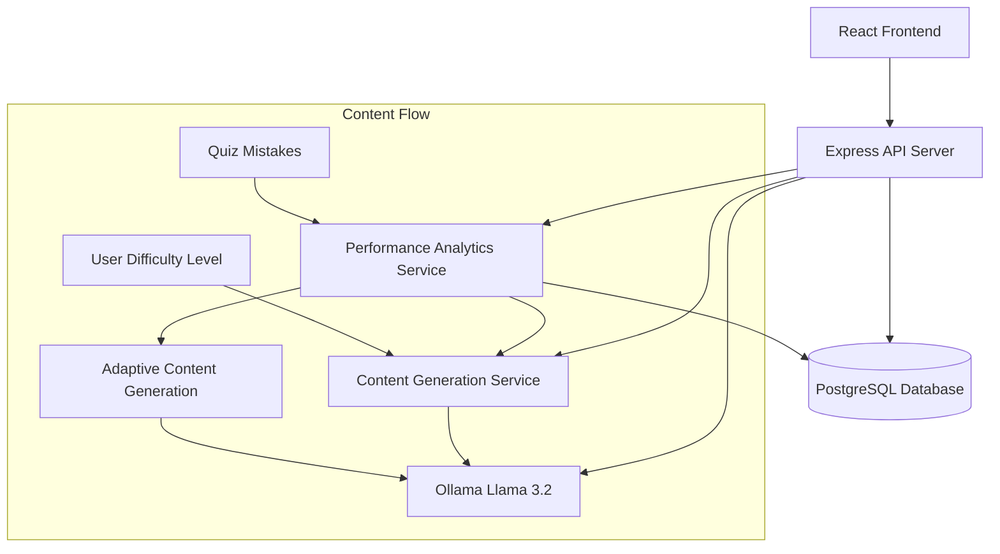

# Design Document

## Overview

The Adaptive Learning System integrates Ollama's Llama 3.2 model into the existing language learning platform to create personalized educational content. The system will generate chapters, modules, quizzes, tests, and flashcards based on user difficulty levels and performance analytics. It leverages the existing database schema while adding new AI-powered content generation capabilities.

## Architecture

### High-Level Architecture



### Service Layer Architecture

The system follows a layered architecture pattern:

1. **Presentation Layer**: React components for content display and interaction
2. **API Layer**: Express.js routes and controllers
3. **Service Layer**: Business logic for content generation and analytics
4. **Integration Layer**: Ollama client and database access
5. **Data Layer**: PostgreSQL with Prisma ORM

## Components and Interfaces

### 1. Ollama Integration Service

**Purpose**: Manages communication with Ollama Llama 3.2 model

```javascript
class OllamaService {
  async generateChapter(difficulty, topic, userContext)
  async generateQuiz(moduleContent, difficulty)
  async generateFlashcards(mistakes, concepts)
  async generateReviewContent(weakAreas, userProgress)
}
```

**Key Features**:
- Connection management and health checks
- Prompt engineering for different content types
- Response validation and error handling
- Retry logic with exponential backoff

### 2. Content Generation Service

**Purpose**: Orchestrates AI content creation based on user needs

```javascript
class ContentGenerationService {
  async createAdaptiveChapter(userId, difficulty)
  async generateModuleQuizzes(chapterId, modules)
  async createPersonalizedTests(userId, mistakePatterns)
  async generateTargetedFlashcards(userId, weakConcepts)
}
```

**Integration Points**:
- Uses existing Chapter, Lesson, Quest models
- Leverages Mistake and Progress tracking
- Creates Flashcard entries with SRS scheduling

### 3. Performance Analytics Service

**Purpose**: Analyzes user performance to guide content adaptation

```javascript
class AnalyticsService {
  async analyzeMistakePatterns(userId)
  async calculateDifficultyAdjustment(userId, currentLevel)
  async identifyWeakConcepts(userId, timeframe)
  async generateLearningInsights(userId)
}
```

### 4. Adaptive Learning Controller

**Purpose**: API endpoints for adaptive learning features

**Endpoints**:
- `POST /api/adaptive/generate-chapter` - Generate new chapter based on difficulty
- `GET /api/adaptive/next-content/:userId` - Get next recommended content
- `POST /api/adaptive/analyze-performance` - Trigger performance analysis
- `GET /api/adaptive/review-materials/:userId` - Get personalized review content

## Data Models

### Extended Database Schema

The system leverages existing models and adds new fields:

**Enhanced Chapter Model**:
- Add `aiGenerated: Boolean` field
- Add `generationPrompt: String` field for reproducibility
- Add `adaptationLevel: String` for difficulty tracking

**Enhanced Lesson Model**:
- Add `aiGeneratedContent: Boolean` field
- Add `personalizedFor: Int[]` for user-specific content

**New AdaptiveLearningSession Model**:
```prisma
model AdaptiveLearningSession {
  id              Int      @id @default(autoincrement())
  userId          Int
  difficulty      String   // beginner | intermediate | advanced
  topicFocus      String[] // Areas of focus based on performance
  generatedAt     DateTime @default(now())
  chaptersCreated Int      @default(0)
  
  user User @relation(fields: [userId], references: [id])
}
```

**Enhanced AiGenerationLog Model**:
- Add `userId: Int` for user-specific tracking
- Add `contentType: String` for categorization
- Add `adaptationReason: String` for why content was generated

## Error Handling

### Ollama Connection Management

1. **Connection Health Checks**: Regular ping to Ollama service
2. **Graceful Degradation**: Fallback to pre-generated content when Ollama is unavailable
3. **Retry Logic**: Exponential backoff for failed requests
4. **Circuit Breaker**: Temporary disable Ollama calls if failure rate exceeds threshold

### Content Generation Failures

1. **Validation Layer**: Ensure generated content meets quality standards
2. **Fallback Content**: Use template-based content when AI generation fails
3. **User Notification**: Inform users when using fallback content
4. **Logging**: Comprehensive error logging for debugging

### Data Consistency

1. **Transaction Management**: Ensure atomic operations for content creation
2. **Rollback Mechanisms**: Undo partial content generation on failures
3. **Data Validation**: Validate AI-generated content before database storage

## Testing Strategy

### Unit Testing

1. **Service Layer Tests**: Mock Ollama responses for consistent testing
2. **Content Validation Tests**: Ensure generated content meets requirements
3. **Analytics Logic Tests**: Verify mistake pattern analysis accuracy
4. **Database Integration Tests**: Test data persistence and retrieval

### Integration Testing

1. **Ollama Integration Tests**: Test actual Ollama communication (with test model)
2. **End-to-End Content Flow**: Test complete content generation pipeline
3. **Performance Testing**: Measure response times for content generation
4. **Error Scenario Testing**: Test system behavior under various failure conditions

### User Acceptance Testing

1. **Content Quality Assessment**: Human evaluation of generated content
2. **Adaptive Behavior Testing**: Verify system adapts to user performance
3. **User Experience Testing**: Ensure smooth interaction with adaptive features
4. **Performance Impact Testing**: Measure system performance with AI integration

## Implementation Phases

### Phase 1: Core Ollama Integration
- Set up Ollama client and connection management
- Implement basic content generation for chapters
- Add database schema extensions
- Create basic API endpoints

### Phase 2: Adaptive Content Generation
- Implement performance analytics service
- Add mistake pattern analysis
- Create personalized content generation
- Integrate with existing quiz system

### Phase 3: Advanced Adaptation
- Implement flashcard generation from mistakes
- Add review content personalization
- Create difficulty adjustment algorithms
- Add comprehensive error handling

### Phase 4: Optimization and Polish
- Performance optimization for content generation
- Advanced prompt engineering for better content
- User interface enhancements
- Comprehensive testing and bug fixes